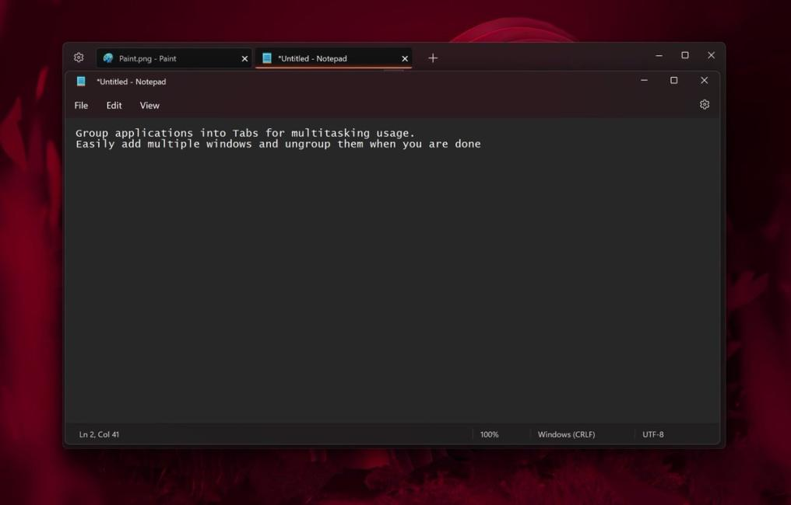

# United Sets (BETA)

An open-sourced program that groups windows into tabs, inspired by the unreleased Sets feature 

Microsoft Store Download Link: https://www.microsoft.com/store/apps/9N7CWZ3L5RWL

Experimental InDev Version (Contains more features, but some are still buggy): https://www.microsoft.com/store/apps/9N9FR4ZZ6TQP (Warning: Installing this version will replace the regular version!)

## Screenshot

## Warning

The program is still in the beta state. Therefore, bugs and minor inconveniences are to be expected. If we find a bug, we will put them in the [Issues](https://github.com/FireCubeStudios/UnitedSets/issues) Tab. However, we might be unable to list all of them and/or we don't know about the bug. Therefore, feel free to create the issue if you find a bug.
